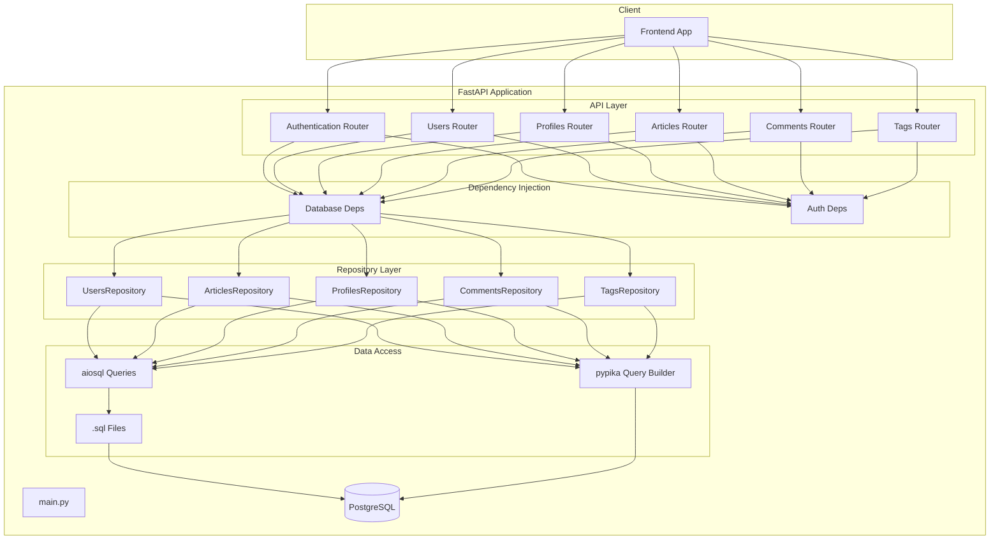
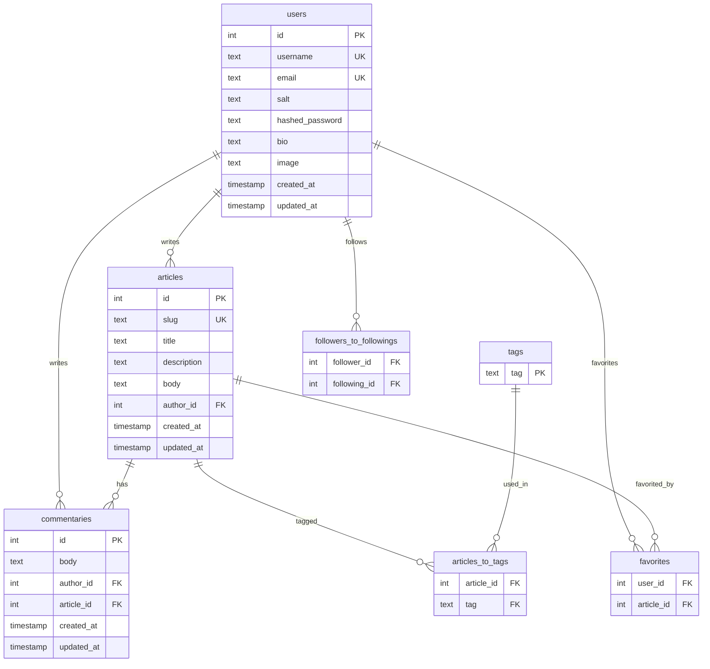
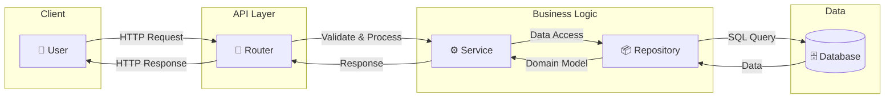
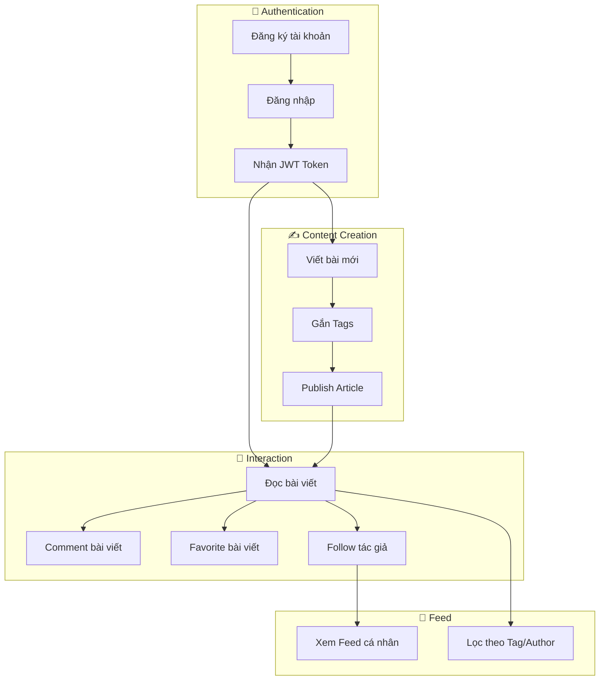
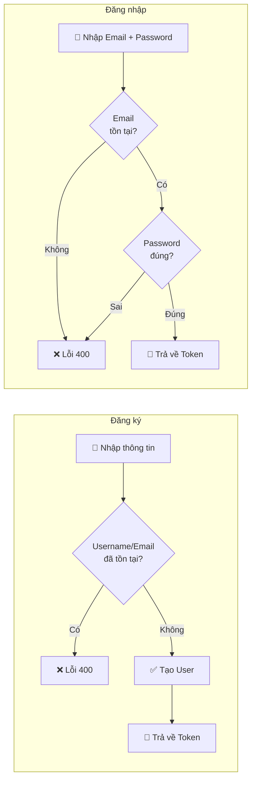
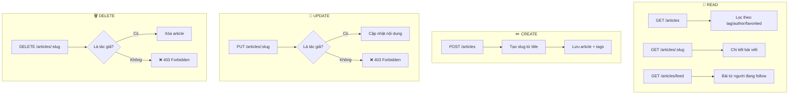
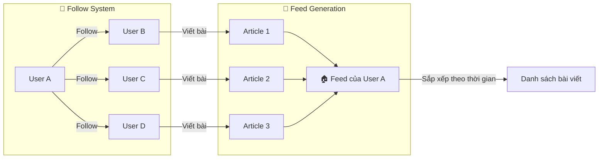
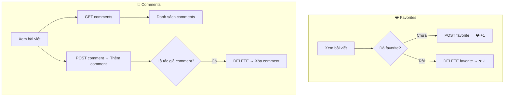
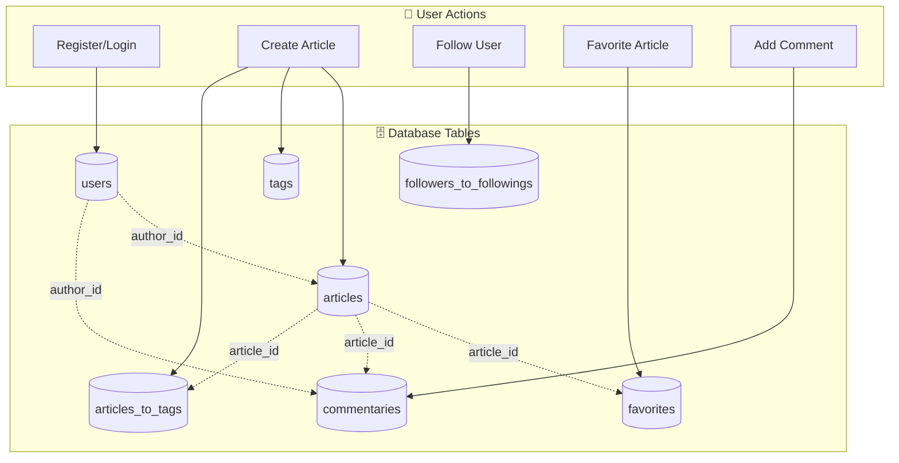

# FastAPI RealWorld Example App - Tổng quan kiến trúc

## 🎯 Dự án này làm gì?

Đây là backend API cho một ứng dụng **Medium.com clone** (còn gọi là "Conduit"), implement theo spec của [RealWorld](https://github.com/gothinkster/realworld). Dự án cung cấp các tính năng:

- **Authentication**: Đăng ký, đăng nhập với JWT token
- **User Profiles**: Xem profile, follow/unfollow người dùng
- **Articles**: CRUD bài viết, lọc theo tag/author/favorited
- **Comments**: Comment trên bài viết
- **Tags**: Gắn tag cho bài viết
- **Favorites**: Yêu thích bài viết
- **Feed**: Xem bài viết từ những người mình follow

---

## 🏗️ Kiến trúc tổng quan



---

## 📁 Cấu trúc thư mục

```
app/
├── main.py                 # Entry point, khởi tạo FastAPI app
├── api/
│   ├── routes/             # API endpoints
│   │   ├── authentication.py   # POST /api/users/login, POST /api/users
│   │   ├── users.py            # GET/PUT /api/user
│   │   ├── profiles.py         # GET /api/profiles/{username}, follow/unfollow
│   │   ├── articles/           # CRUD articles, feed, favorites
│   │   ├── comments.py         # CRUD comments cho article
│   │   └── tags.py             # GET /api/tags
│   ├── dependencies/       # FastAPI Depends() factories
│   │   ├── database.py         # Inject Repository instances
│   │   └── authentication.py   # Inject current user from JWT
│   └── errors/             # Exception handlers
├── core/
│   ├── config.py           # Settings (database URL, secret key, etc.)
│   └── events.py           # Startup/shutdown events (DB pool)
├── db/
│   ├── repositories/       # Data access layer
│   │   ├── users.py
│   │   ├── articles.py
│   │   ├── comments.py
│   │   ├── profiles.py
│   │   └── tags.py
│   ├── queries/
│   │   ├── sql/            # Native SQL files (aiosql)
│   │   │   ├── users.sql
│   │   │   ├── articles.sql
│   │   │   ├── comments.sql
│   │   │   ├── profiles.sql
│   │   │   └── tags.sql
│   │   ├── queries.py      # aiosql loader
│   │   └── tables.py       # pypika table definitions
│   └── migrations/         # Alembic migrations
├── models/
│   ├── domain/             # Business entities (Pydantic)
│   │   ├── users.py        # User, UserInDB
│   │   ├── articles.py     # Article
│   │   ├── comments.py     # Comment
│   │   └── profiles.py     # Profile
│   └── schemas/            # Request/Response schemas (Pydantic)
├── services/               # Business logic (JWT, password hashing)
└── resources/              # String constants
```

---

## 📊 Database Schema



---

## 🔄 Luồng hoạt động chính (High-Level)

### 1. Tổng quan luồng Request



---

### 2. User Journey: Đăng ký → Viết bài → Tương tác



---

### 3. Luồng Authentication (Đăng ký / Đăng nhập)



---

### 4. Luồng Article (Tạo / Đọc / Sửa / Xóa)



---

### 5. Luồng Follow & Feed



---

### 6. Luồng Favorites & Comments



---

### 7. Data Flow Overview



---

## 🔧 API Endpoints Summary

| Method | Endpoint | Description | Auth Required |
|--------|----------|-------------|---------------|
| **Authentication** |
| POST | `/api/users` | Register new user | ❌ |
| POST | `/api/users/login` | Login user | ❌ |
| **User** |
| GET | `/api/user` | Get current user | ✅ |
| PUT | `/api/user` | Update current user | ✅ |
| **Profiles** |
| GET | `/api/profiles/{username}` | Get profile | ❌ (optional) |
| POST | `/api/profiles/{username}/follow` | Follow user | ✅ |
| DELETE | `/api/profiles/{username}/follow` | Unfollow user | ✅ |
| **Articles** |
| GET | `/api/articles` | List/Filter articles | ❌ (optional) |
| GET | `/api/articles/feed` | Get feed | ✅ |
| GET | `/api/articles/{slug}` | Get article | ❌ (optional) |
| POST | `/api/articles` | Create article | ✅ |
| PUT | `/api/articles/{slug}` | Update article | ✅ (author only) |
| DELETE | `/api/articles/{slug}` | Delete article | ✅ (author only) |
| POST | `/api/articles/{slug}/favorite` | Favorite article | ✅ |
| DELETE | `/api/articles/{slug}/favorite` | Unfavorite article | ✅ |
| **Comments** |
| GET | `/api/articles/{slug}/comments` | Get comments | ❌ (optional) |
| POST | `/api/articles/{slug}/comments` | Create comment | ✅ |
| DELETE | `/api/articles/{slug}/comments/{id}` | Delete comment | ✅ (author only) |
| **Tags** |
| GET | `/api/tags` | Get all tags | ❌ |

---

## 🗃️ Domain Models

### User & UserInDB

```python
class User(RWModel):
    username: str           # Unique username
    email: str              # Unique email
    bio: str = ""           # User bio
    image: Optional[str]    # Avatar URL

class UserInDB(User):
    id_: int                # Database ID
    salt: str               # Password salt
    hashed_password: str    # Hashed password
    created_at: datetime
    updated_at: datetime
```

### Article

```python
class Article(RWModel):
    id_: int
    slug: str               # URL-friendly identifier
    title: str
    description: str
    body: str
    tags: List[str]         # Tag names
    author: Profile         # Author profile
    favorited: bool         # Is favorited by current user?
    favorites_count: int    # Total favorites
    created_at: datetime
    updated_at: datetime
```

### Comment

```python
class Comment(RWModel):
    id_: int
    body: str
    author: Profile         # Comment author
    created_at: datetime
    updated_at: datetime
```

### Profile

```python
class Profile(RWModel):
    username: str
    bio: str
    image: Optional[str]
    following: bool         # Is current user following this profile?
```

---

## 🔗 Relationship Summary

| Relationship | Type | Description |
|-------------|------|-------------|
| User → Articles | One-to-Many | User viết nhiều bài |
| User → Comments | One-to-Many | User viết nhiều comment |
| User ↔ User (followers) | Many-to-Many | User follow nhiều user khác |
| User ↔ Article (favorites) | Many-to-Many | User favorite nhiều bài, bài có nhiều favorites |
| Article → Comments | One-to-Many | Bài có nhiều comment |
| Article ↔ Tags | Many-to-Many | Bài có nhiều tags, tag thuộc nhiều bài |

---

## 🔍 Native SQL Queries hiện tại

### [users.sql](file:///c:/Users/vieth/Documents/fastapi-realworld-example-app/app/db/queries/sql/users.sql)
- `get-user-by-email` - Tìm user theo email
- `get-user-by-username` - Tìm user theo username
- `create-new-user` - Tạo user mới
- `update-user-by-username` - Cập nhật user

### [articles.sql](file:///c:/Users/vieth/Documents/fastapi-realworld-example-app/app/db/queries/sql/articles.sql)
- `add-article-to-favorites` - Favorite bài viết
- `remove-article-from-favorites` - Unfavorite
- `is-article-in-favorites` - Check đã favorite chưa
- `get-favorites-count-for-article` - Đếm favorites
- `get-tags-for-article-by-slug` - Lấy tags của bài
- `get-article-by-slug` - Lấy bài theo slug
- `create-new-article` - Tạo bài mới
- `add-tags-to-article` - Gắn tags
- `update-article` - Cập nhật bài
- `delete-article` - Xóa bài
- `get-articles-for-feed` - Lấy bài từ người đang follow

### [comments.sql](file:///c:/Users/vieth/Documents/fastapi-realworld-example-app/app/db/queries/sql/comments.sql)
- `get-comments-for-article-by-slug` - Lấy comments
- `get-comment-by-id-and-slug` - Lấy 1 comment
- `create-new-comment` - Tạo comment
- `delete-comment-by-id` - Xóa comment

### [profiles.sql](file:///c:/Users/vieth/Documents/fastapi-realworld-example-app/app/db/queries/sql/profiles.sql)
- `is-user-following-for-another` - Check follow status
- `subscribe-user-to-another` - Follow
- `unsubscribe-user-from-another` - Unfollow

### [tags.sql](file:///c:/Users/vieth/Documents/fastapi-realworld-example-app/app/db/queries/sql/tags.sql)
- `get-all-tags` - Lấy tất cả tags
- `create-new-tags` - Tạo tags mới

---

## ⚙️ Data Access Pattern hiện tại

### 1. aiosql (Native SQL)
```python
# queries.py
queries = aiosql.from_path(Path(__file__).parent / "sql", "asyncpg")

# Repository usage
user_row = await queries.get_user_by_email(self.connection, email=email)
```

### 2. pypika (Query Builder)
Dùng cho dynamic queries như filter articles:
```python
query = Query.from_(articles).select(...)
if tag:
    query = query.join(articles_to_tags).on(...)
if author:
    query = query.join(users).on(...)
articles_rows = await self.connection.fetch(query.get_sql(), *params)
```

---

## 📝 Key Insights cho ORM Migration

1. **N+1 Query Problem**: Method `_get_article_from_db_record` gọi 4 queries riêng lẻ cho mỗi article (tags, favorites_count, is_favorited, author profile). SQLAlchemy ORM với eager loading sẽ tối ưu hơn.

2. **Many-to-Many operations**: Hiện tại dùng INSERT/DELETE trực tiếp vào junction tables. SQLAlchemy relationship collections sẽ đơn giản hơn.

3. **Subqueries**: Nhiều SQL queries dùng subquery để lookup ID từ username/slug. ORM sẽ handle relationships tự động.

4. **Dynamic filtering**: pypika Query builder sẽ được thay bằng SQLAlchemy Core `select().where().join()`.

5. **Transaction management**: Hiện tại dùng `connection.transaction()`. SQLAlchemy session sẽ handle commits/rollbacks.
